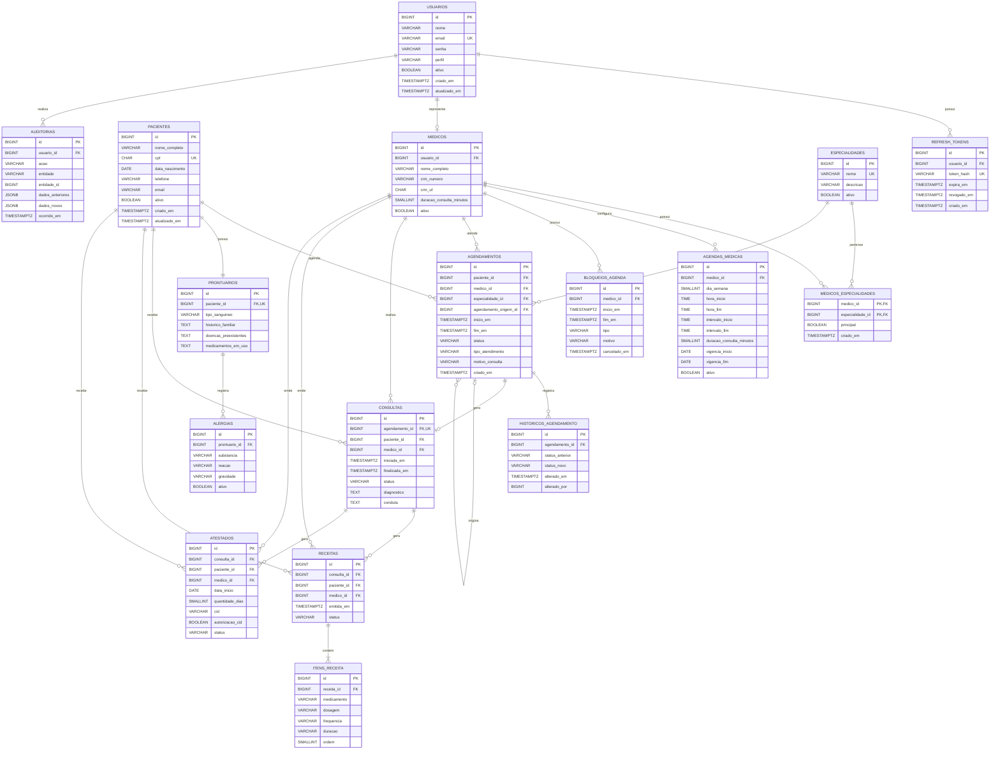

# Diagrama do Banco de Dados

## Diagrama lógico simplificado



## Observações

Este diagrama representa a estrutura lógica inicial do MVP.

Alguns campos foram omitidos para melhorar a visualização.

A documentação completa está disponível em:

```text
docs/04-database-modeling.md
```